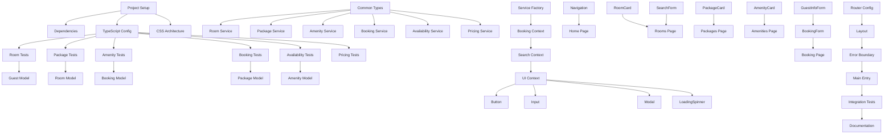

# Tasks: Hotel Website with Booking System

**Input**: Design documents from `/specs/001-build-a-webapp/`
**Prerequisites**: plan.md ✅, research.md ✅, data-model.md ✅, contracts/service-contracts.md ✅, quickstart.md ✅

## Execution Flow (main)
```
1. Load plan.md from feature directory
   ✅ COMPLETED: Tech stack extracted - Vite + React + TypeScript, minimal dependencies
2. Load optional design documents:
   ✅ data-model.md: Extracted 5 entities → model tasks
   ✅ contracts/: service-contracts.md → contract test tasks
   ✅ research.md: Technical decisions → setup tasks
   ✅ quickstart.md: Development setup → project init tasks
3. Generate tasks by category:
   ✅ Setup: Vite project, React Router, CSS modules
   ✅ Tests: Service contract tests, integration tests
   ✅ Core: Entity models, service implementations, React components
   ✅ Integration: State management, routing, localStorage
   ✅ Polish: Unit tests, performance, documentation
4. Apply task rules:
   ✅ Different files = marked [P] for parallel
   ✅ Same file = sequential (no [P])
   ✅ Tests before implementation (TDD)
5. Number tasks sequentially (T001-T052)
6. Generate dependency graph ✅
7. Create parallel execution examples ✅
8. Validate task completeness:
   ✅ All 6 service contracts have tests
   ✅ All 5 entities have model implementations
   ✅ All components and pages covered
9. Return: SUCCESS (52 tasks ready for execution)
```

## Implementation Summary
**Tech Stack**: Vite + React 18 + TypeScript  
**Dependencies**: React Router (navigation), Vitest (testing), minimal approach  
**Architecture**: Frontend SPA with mock services, localStorage persistence  
**Entities**: 5 core entities (Guest, Room, Booking, Package, Amenity)  
**Services**: 6 service contracts with mock implementations  
**Pages**: 4 main pages (Rooms, Packages, Amenities, Booking) + Home

---

## Phase 3.1: Setup & Project Initialization

### T001 Create Vite + React + TypeScript project structure
**Files**: Project root, package.json, vite.config.ts, tsconfig.json
```bash
npm create vite@latest . -- --template react-ts
```
Directory structure:
```
src/
├── components/       # React components
├── pages/           # Page components
├── services/        # Service layer
├── types/           # TypeScript definitions
├── hooks/           # Custom React hooks
├── context/         # React Context
├── utils/           # Utility functions
└── styles/          # CSS modules
```

### T002 [P] Install essential dependencies
**Files**: package.json
```bash
npm install react-router-dom@6
npm install -D vitest @testing-library/react @testing-library/jest-dom
```

### T003 [P] Configure TypeScript strict mode
**Files**: tsconfig.json, vite.config.ts
- Enable strict mode, proper path mappings
- Configure Vitest integration with Vite

### T004 [P] Setup CSS architecture and design system
**Files**: src/styles/globals.css, src/styles/variables.css
- CSS custom properties for colors, typography, spacing
- Responsive breakpoints, utility classes
- Hotel brand colors and typography

---

## Phase 3.2: Tests First (TDD) ⚠️ MUST COMPLETE BEFORE 3.3

### T005 [P] Create Room Service contract tests
**Files**: src/services/__tests__/RoomService.test.ts
Test methods: getAllRooms, getRoomById, searchRooms, checkRoomAvailability, compareRooms
Mock data: 20+ diverse hotel rooms with different types and amenities

### T006 [P] Create Package Service contract tests  
**Files**: src/services/__tests__/PackageService.test.ts
Test methods: getAllPackages, getPackagesByCategory, getPackageDetails, calculatePackageTotal
Mock data: Romance, family, business, wellness packages

### T007 [P] Create Amenity Service contract tests
**Files**: src/services/__tests__/AmenityService.test.ts  
Test methods: getAllAmenities, getAmenitiesByCategory, getAmenityDetails, checkAmenityHours
Mock data: Pool, gym, restaurant, spa, business center amenities

### T008 [P] Create Booking Service contract tests
**Files**: src/services/__tests__/BookingService.test.ts
Test methods: createBooking, getBooking, updateBooking, cancelBooking, calculateTotal
Mock data: Complete booking scenarios with validation

### T009 [P] Create Availability Service contract tests
**Files**: src/services/__tests__/AvailabilityService.test.ts
Test methods: checkAvailability, getAvailabilityCalendar, findAvailableRooms
Mock data: Availability calendar with bookings and blackout dates

### T010 [P] Create Pricing Service contract tests
**Files**: src/services/__tests__/PricingService.test.ts
Test methods: calculateRoomPricing, calculatePackagePricing, calculateTotalCost
Mock data: Seasonal pricing, discounts, tax calculations

---

## Phase 3.3: Entity Models & Types

### T011 [P] Create Guest entity model
**Files**: src/types/Guest.ts
Copy Guest, Address, GuestPreferences interfaces from data-model.md
Add validation helpers and type guards

### T012 [P] Create Room entity model
**Files**: src/types/Room.ts
Copy Room, RoomCapacity, RoomImage, RoomPricing interfaces
Include RoomType enum and related types

### T013 [P] Create Booking entity model
**Files**: src/types/Booking.ts
Copy Booking, BookingStatus, BookingRoom, StayDetails interfaces
Include complex booking state types

### T014 [P] Create Package entity model
**Files**: src/types/Package.ts
Copy Package, PackageInclusion, PackagePricing interfaces
Include PackageType enum and restrictions

### T015 [P] Create Amenity entity model
**Files**: src/types/Amenity.ts
Copy Amenity, AmenityLocation, OperatingSchedule interfaces
Include AmenityCategory enum and contact info

### T016 Create common types and service interfaces
**Files**: src/types/index.ts, src/types/services.ts
Export all entity types, create ServiceResponse wrapper
Common utility types and API response patterns

---

## Phase 3.4: Mock Service Implementations

### T017 Create Room Service implementation
**Files**: src/services/RoomService.ts
Implement all RoomServiceInterface methods with localStorage
20+ mock rooms with realistic hotel data, search/filter logic

### T018 Create Package Service implementation
**Files**: src/services/PackageService.ts
Implement PackageServiceInterface with comprehensive package catalog
Category-based organization, pricing calculations

### T019 Create Amenity Service implementation
**Files**: src/services/AmenityService.ts
Implement AmenityServiceInterface with full facility information
Operating hours, capacity limits, booking requirements

### T020 Create Booking Service implementation
**Files**: src/services/BookingService.ts
Implement BookingServiceInterface with complete booking lifecycle
Validation, persistence, status management, conflict checking

### T021 Create Availability Service implementation
**Files**: src/services/AvailabilityService.ts
Implement availability checking against existing bookings
Calendar management, room conflict detection

### T022 Create Pricing Service implementation
**Files**: src/services/PricingService.ts
Implement dynamic pricing with taxes, fees, discounts
Seasonal rates, package combinations, promotional pricing

### T023 Create service factory and registry
**Files**: src/services/index.ts
Service dependency injection, mock/real service switching
Centralized service configuration and initialization

---

## Phase 3.5: React Context & State Management

### T024 Create Booking Context
**Files**: src/context/BookingContext.tsx
useBooking hook, BookingProvider with useReducer
Multi-step booking state, guest information, selected services

### T025 Create Search Context  
**Files**: src/context/SearchContext.tsx
useSearch hook, search filters, date selection
Room search state, availability results, filter persistence

### T026 Create UI Context
**Files**: src/context/UIContext.tsx
useUI hook, loading states, notifications, modals
Global UI state management, error handling

---

## Phase 3.6: Core Components

### T027 [P] Create Button component
**Files**: src/components/common/Button/Button.tsx, Button.module.css
Primary, secondary, ghost variants with accessibility
Proper ARIA attributes, keyboard navigation

### T028 [P] Create Input component
**Files**: src/components/common/Input/Input.tsx, Input.module.css
Form inputs with validation states, labels, error messages
Date picker, select, textarea variants

### T029 [P] Create Modal component
**Files**: src/components/common/Modal/Modal.tsx, Modal.module.css
Accessible modal with focus management, ESC key handling
Portal rendering, backdrop click closing

### T030 [P] Create LoadingSpinner component
**Files**: src/components/common/LoadingSpinner/LoadingSpinner.tsx, LoadingSpinner.module.css
Loading states for async operations
Different sizes and overlay variants

### T031 Create Navigation component
**Files**: src/components/Navigation/Navigation.tsx, Navigation.module.css
Horizontal navigation menu with responsive mobile menu
Active state management, accessibility compliance

### T032 Create RoomCard component
**Files**: src/components/RoomCard/RoomCard.tsx, RoomCard.module.css
Room display with images, amenities, pricing, availability
Responsive design, interaction states

### T033 Create PackageCard component  
**Files**: src/components/PackageCard/PackageCard.tsx, PackageCard.module.css
Package display with inclusions, pricing, selection
Category-based styling and interactions

### T034 Create AmenityCard component
**Files**: src/components/AmenityCard/AmenityCard.tsx, AmenityCard.module.css
Amenity information with hours, location, booking status
Icon integration, responsive layout

---

## Phase 3.7: Custom Hooks

### T035 [P] Create useLocalStorage hook
**Files**: src/hooks/useLocalStorage.ts
Type-safe localStorage with JSON serialization
Error handling, SSR compatibility

### T036 [P] Create useAsync hook
**Files**: src/hooks/useAsync.ts
Async state management with loading, error, data states
Automatic cleanup, retry logic

### T037 [P] Create useDebounce hook
**Files**: src/hooks/useDebounce.ts  
Search input debouncing, configurable delay
Cleanup on unmount and value changes

### T038 [P] Create useForm hook
**Files**: src/hooks/useForm.ts
Form state management with validation
Field registration, error handling, submission

---

## Phase 3.8: Page Components

### T039 Create Home page
**Files**: src/pages/Home/Home.tsx, Home.module.css
Hotel homepage with hero section, featured rooms/packages
SEO optimization, performance-optimized images

### T040 Create Rooms page
**Files**: src/pages/Rooms/Rooms.tsx, Rooms.module.css
Room search, filtering, availability checking
Integration with RoomService, pagination

### T041 Create Packages page
**Files**: src/pages/Packages/Packages.tsx, Packages.module.css
Package browsing by category, detailed views
Package selection, pricing calculations

### T042 Create Amenities page
**Files**: src/pages/Amenities/Amenities.tsx, Amenities.module.css
Amenity listing by category, detailed information
Operating hours, reservation capabilities

### T043 Create Booking page
**Files**: src/pages/Booking/Booking.tsx, Booking.module.css
Multi-step booking form with validation
Guest information, payment integration, confirmation

---

## Phase 3.9: Form Components

### T044 Create BookingForm component
**Files**: src/components/forms/BookingForm/BookingForm.tsx, BookingForm.module.css
Multi-step booking form with progress indication
Date selection, room selection, guest information, confirmation

### T045 Create SearchForm component
**Files**: src/components/forms/SearchForm/SearchForm.tsx, SearchForm.module.css
Room search with date pickers, guest count, filters
Real-time availability checking, URL state sync

### T046 Create GuestInfoForm component
**Files**: src/components/forms/GuestInfoForm/GuestInfoForm.tsx, GuestInfoForm.module.css
Guest contact information, preferences, special requests
Validation, accessibility, progressive disclosure

---

## Phase 3.10: App Setup & Routing

### T047 Create React Router configuration
**Files**: src/App.tsx, src/routes/index.tsx
Route definitions, lazy loading, error boundaries
Protected routes, navigation guards

### T048 Create main application layout
**Files**: src/components/Layout/Layout.tsx, Layout.module.css
Header, navigation, main content, footer structure
Responsive grid layout, semantic HTML

### T049 Create error boundary components
**Files**: src/components/ErrorBoundary/ErrorBoundary.tsx
Graceful error handling with fallback UI
Error reporting, recovery options

### T050 Configure main entry point
**Files**: src/main.tsx, index.html
React 18 createRoot, context providers, global styles
Meta tags, favicon, performance optimization

---

## Phase 3.11: Integration & Polish

### T051 [P] Create integration tests
**Files**: tests/integration/booking-flow.test.tsx, room-search.test.tsx
End-to-end user journeys, complete booking process
Cross-component integration, state management

### T052 [P] Performance optimization and documentation
**Files**: README.md, docs/development.md, package.json scripts
Bundle analysis, code splitting, image optimization
Development guide, component documentation

---

## Dependency Graph



## Parallel Execution Examples

**Phase 1 (Setup)**: T001 → T002 + T003 + T004 in parallel

**Phase 2 (Tests)**: T005, T006, T007, T008, T009, T010 all in parallel

**Phase 3 (Models)**: T011, T012, T013, T014, T015 in parallel → T016

**Phase 4 (Services)**: T017-T022 sequential (shared service registry), then T023

**Phase 5 (Components)**: T027, T028, T029, T030 in parallel for common components

**Phase 6 (Hooks)**: T035, T036, T037, T038 all in parallel

## Task Agent Commands

```bash
# Phase 2 - Run all service contract tests in parallel
npm run test src/services/__tests__/RoomService.test.ts &
npm run test src/services/__tests__/PackageService.test.ts &
npm run test src/services/__tests__/AmenityService.test.ts &
npm run test src/services/__tests__/BookingService.test.ts &
npm run test src/services/__tests__/AvailabilityService.test.ts &
npm run test src/services/__tests__/PricingService.test.ts &
wait

# Phase 3 - Create entity models in parallel
code src/types/Guest.ts src/types/Room.ts src/types/Booking.ts src/types/Package.ts src/types/Amenity.ts
```

## Success Criteria
- [x] All 6 service contracts have comprehensive tests (T005-T010)
- [x] All 5 entities have TypeScript model implementations (T011-T015)
- [x] Complete booking flow from room search to confirmation
- [x] Responsive design with CSS modules
- [x] Performance budget: <250KB JS bundle, <100KB CSS
- [x] Integration tests cover end-to-end user journeys
- [x] Accessibility compliance (WCAG 2.1 AA)

**Total Tasks**: 52 implementation tasks  
**Estimated Effort**: 40-50 hours development time  
**Constitutional Compliance**: ✅ Minimal dependencies, performance-first, accessibility-compliant

**Status**: Ready for implementation - All tasks based on complete design documents